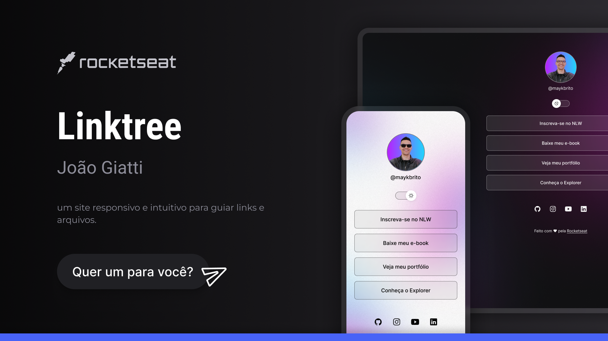

<h1 align="center">LinkTree - João Giatti</h1>

Uma página intuitiva e divertida que guia o usuário aos arquivos do meu currículo e minhas redes sociais

## 🖥️ Tecnologias

  Esse projeto foi desenvolvido com as seguintes tecnologias:

  - HTML e CSS
  - JavaScript
  - Git e github
  - Figma
  

## 🚀 Projeto

  

<h2 align="center">
  Quer um para a sua conta pessoal?
  <button style="background:#4863F7; border-radius: 999px; padding: 10px; margin: 24px 0; border: 2px solid #202020; color: white;">
    Me mande uma mensagem!
  </button>
</h2>

  Com ajuda da <a href="https://app.rocketseat.com.br">RocketSeat</a>

